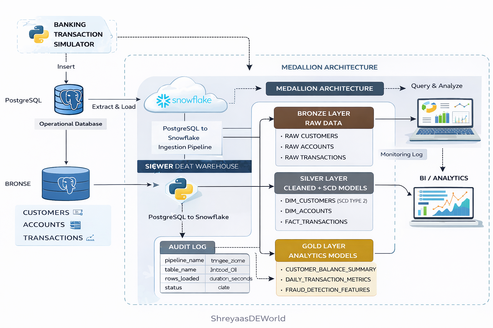

# Retail Banking Data Platform

An end-to-end **data engineering project** simulating a modern retail banking data platform.  
The system generates banking transactions, ingests operational data from PostgreSQL, and processes it into a scalable analytics warehouse using Snowflake and a medallion architecture.

This project demonstrates how real-world financial data platforms are designed for **scalable ingestion, historical tracking, and analytical modeling**.

---

# Architecture Overview

The system follows a **Medallion Architecture** with Bronze, Silver, and Gold layers.

Banking Simulator
↓
PostgreSQL (Operational DB)
↓
Python Ingestion Pipeline
↓
Snowflake Data Warehouse

    Bronze → Raw Data
    Silver → Cleaned + SCD Models
    Gold → Analytics Models

↓

BI / Analytics

---

## Architecture

---

# Tech Stack

| Layer | Technology |
|-----|-----|
Data Simulation | Python |
Operational Database | PostgreSQL |
Ingestion Pipeline | Python |
Data Warehouse | Snowflake |
Transformation Layer | dbt |
Analytics | SQL / BI tools |

---

# Project Components

## 1 Banking Transaction Simulator

A Python-based simulator generates realistic banking activity including:

- Salary deposits
- ATM withdrawals
- POS purchases
- Bill payments
- Transfers

The generated transactions are written into PostgreSQL.

Example tables:
web_banking.customers
web_banking.accounts
web_banking.transactions

## 2 Data Ingestion Pipeline

A Python ingestion pipeline extracts data from PostgreSQL and loads it into Snowflake.

Key features:

- Batch extraction
- Bulk loading using Snowflake `write_pandas`
- Pipeline logging
- Audit table for monitoring

Example pipeline run:
Loading web_banking.transactions → transactions_raw
2089000 rows loaded in 82 seconds
---

## 3 Data Warehouse Architecture

The warehouse is implemented in Snowflake using a **layered architecture**.

### Bronze Layer (Raw Data)

Raw ingested tables replicated from PostgreSQL.
bronze.customers_raw
bronze.accounts_raw
bronze.transactions_raw

---

### Silver Layer (Curated Data)

Cleaned datasets with historical tracking.

silver.dim_customers (SCD Type 2)
silver.dim_accounts
silver.fact_transactions

---

### Gold Layer (Analytics)

Business-ready datasets for analytics.

Examples:
customer_balance_summary
daily_transaction_metrics
fraud_detection_features

---

# Observability

Pipeline monitoring is implemented using:

### Logging

Each pipeline run records:

- pipeline start time
- batch execution details
- rows processed
- total runtime

### Audit Table
bronze.pipeline_audit_log

Example fields:

| Column | Description |
|------|------|
pipeline_name | ingestion job |
table_name | processed table |
rows_loaded | records ingested |
duration_seconds | runtime |
status | success / failure |

---

# Scalability Design

The pipeline is designed to handle large transaction volumes using:

- batch ingestion
- chunk-based extraction
- bulk Snowflake loading
- incremental ingestion (planned)

Current dataset:
2M+ banking transactions

---

# Running the Project

### 1 Clone repository
git clone <repo-url>
cd retail-banking-data-platform

python -m venv venv
source venv/bin/activate   # Mac/Linux
venv\Scripts\activate      # Windows

pip install -r requirements.txt

### 2 Run transaction simulator
python simulator/generate_transactions.py
### 3 Run ingestion pipeline

python ingestion/postgres_to_snowflake_ingestion.py

---

# Project Status

Current progress:

✔ Transaction simulator  
✔ PostgreSQL operational schema  
✔ Batch ingestion pipeline  
✔ Snowflake Bronze layer  
✔ Pipeline logging & monitoring  

Next steps:

- dbt transformation models
- SCD Type 2 snapshots
- incremental ingestion
- analytics datasets

---

# Learning Goals

This project demonstrates:

- data ingestion architecture
- scalable ETL pipelines
- medallion warehouse design
- SCD Type 2 modeling
- observability in data pipelines

---

# Author

Shreyaas  
Data Engineering Project

Small Repo Structure (Recommended)

Retail-Banking-Data-Platform
│
├── ingestion
│   └── postgres_to_snowflake_ingestion.py
│
├── simulator
│   └── generate_transactions.py
│
├── config.py
├── db_connection.py
│
├── docs
│   └── architecture.png
│
├── requirements.txt
├── README.md
├── .env.example
└── .gitignore

